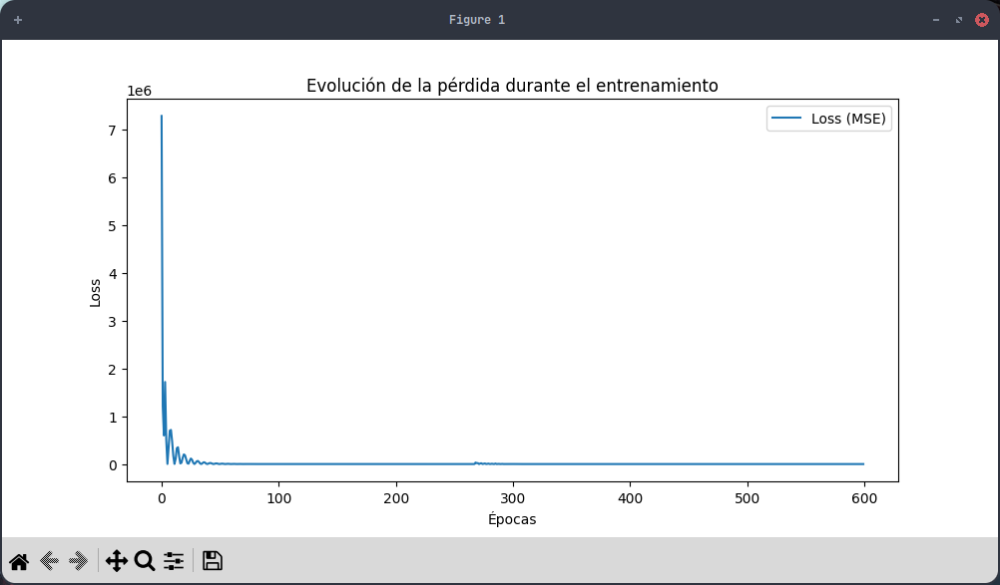

# Conversor Celsius → Fahrenheit con Red Neuronal

Este proyecto es un **ejemplo didáctico de Inteligencia Artificial** para predecir la conversión de grados Celsius a Fahrenheit utilizando una red neuronal **pequeña**. Está diseñado para explicar conceptos fundamentales de redes neuronales y entrenamiento de modelos, incluyendo **neuronas, capas ocultas, épocas, sesgos y optimización**.

---

## 🧠 Conceptos clave de IA en este proyecto

1. **Neuronas y capas:**

   * Cada capa de la red contiene varias **neuronas** que reciben información, la procesan mediante una función de activación (`relu` en este caso) y la pasan a la siguiente capa.
   * Las **capas ocultas** permiten que la red aprenda relaciones no lineales entre Celsius y Fahrenheit.

2. **Sesgos y pesos:**

   * Cada conexión entre neuronas tiene un **peso** y cada neurona un **sesgo**.
   * La red ajusta estos parámetros durante el entrenamiento para minimizar el error entre predicciones y valores reales.

3. **Épocas:**

   * Una **época** es una pasada completa de todos los datos de entrenamiento por la red.
   * Aunque después de cierta época (por ejemplo la 200) los cambios parecen pequeños, continuar hasta la época 600 permite que la red alcance un ajuste óptimo más fino, evitando perder exactitud. Reducir a 300 épocas puede resultar en predicciones ligeramente menos precisas porque la red no llega a su configuración óptima de pesos y sesgos.

4. **Función de pérdida (MSE):**

   * Usamos **Mean Squared Error (MSE)** para medir qué tan lejos están las predicciones de los valores reales.
   * La red ajusta sus parámetros para minimizar esta pérdida durante el entrenamiento.

5. **Optimización:**

   * Se utiliza el optimizador **Adam**, que adapta la velocidad de aprendizaje de cada peso, haciendo el entrenamiento más eficiente y estable.

---

## 📊 Flujo del proyecto

1. **Entrenamiento:**

   * La red se entrena con 10 pares de valores Celsius → Fahrenheit.
   * El entrenamiento se ejecuta durante **600 épocas**, guardando la pérdida de cada época para visualizarla.

2. **Visualización:**

   * Se muestra un gráfico de la evolución de la pérdida durante el entrenamiento para entender cómo la red aprende con cada pasada.

3. **Predicción interactiva:**

   * Al final del entrenamiento, se puede ingresar cualquier valor Celsius y la red predice el equivalente en Fahrenheit.

---

## 💻 Cómo usar

1. Clonar el repositorio:

```bash
git clone https://github.com/anonymous-17-03/Predecir_CaF.git
cd Predecir_CaF
```

2. Instalar dependencias (recomendado usar un virtualenv):

```bash
pip install tensorflow matplotlib numpy
```

3. Ejecutar el script:

```bash
python Codigo_CaF.py     # Para convertir valores manualmente
python Predecir_CaF.py   # Para entrenar la red y hacer predicciones
```

4. Ingresar valores Celsius en el prompt y obtener la conversión.

---

## 📈 Ejemplo de gráfica de pérdida

Durante el entrenamiento, la red genera una gráfica como esta:



> La gráfica muestra cómo la **pérdida disminuye** conforme aumentan las épocas, y aunque a partir de la época 100 las mejoras parecen menores, seguir hasta 600 permite que la red alcance el ajuste óptimo y no pierda precisión.

---

## ⚙️ Explicación de la elección de épocas

* A veces, después de cierta época (100-300), la **pérdida parece estabilizarse**. Esto puede dar la falsa impresión de que el entrenamiento ya no mejora nada.
* Sin embargo, la red todavía ajusta pequeños detalles de los pesos y sesgos, que son importantes para **maximizar la exactitud**.
* Por eso, reducir de 600 a 300 épocas puede resultar en un modelo menos preciso, incluso si visualmente la gráfica parece similar.

---

## 🔑 Conclusión

Este proyecto demuestra cómo una **red neuronal simple** puede aprender relaciones matemáticas entre variables, cómo el entrenamiento con múltiples épocas mejora gradualmente la precisión y cómo la visualización de la pérdida ayuda a comprender el proceso de aprendizaje. 
